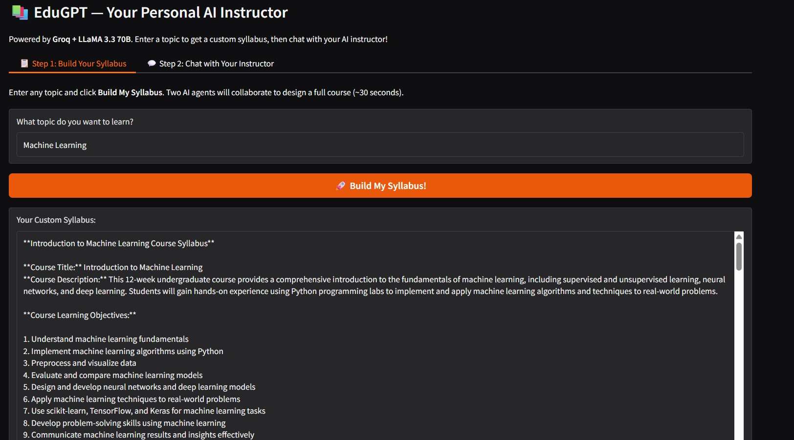
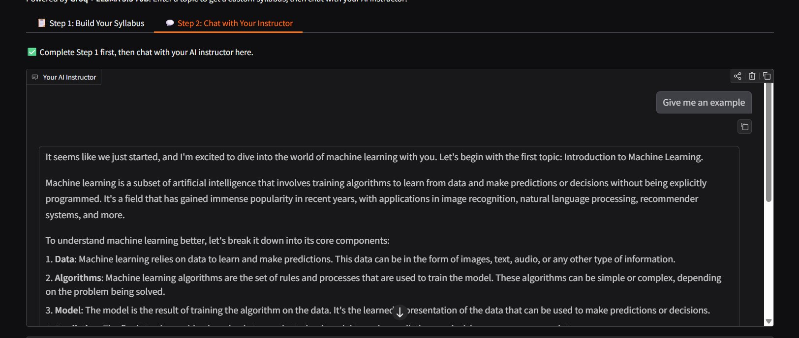

# 📚 EduGPT — Your Personal AI Instructor

> An intelligent tutoring system powered by **Groq + LLaMA 3.3 70B** that designs a custom syllabus for any topic and then teaches it to you interactively — for free.

[](https://huggingface.co/spaces/KeerthanaKN/EduGPT)


---

## 🌐 Live Demo

**👉 [Try EduGPT on Hugging Face Spaces](https://huggingface.co/spaces/KeerthanaKN/EduGPT)** — no setup needed, runs in your browser for free.

---

## 📸 Screenshots

### Step 1 — AI Agents Build Your Custom Syllabus


### Step 2 — Chat with Your AI Instructor


---

## 🎯 What Does It Do?

EduGPT acts as your personal AI instructor. You tell it a topic — two AI agents debate and collaborate to design a full course syllabus, then a dedicated instructor agent teaches you step-by-step through an interactive chat.

**Example:** Type `"Machine Learning"` → get a 12-week structured syllabus → chat with your AI instructor who teaches you the whole course, answers questions, and gives examples.

---

## ✨ Key Features

- 🧠 **Multi-Agent Syllabus Design** — Two AI agents (Instructor + Teaching Assistant) engage in structured dialogue to collaboratively design a course for any topic
- 📖 **Adaptive AI Instruction** — A dedicated instructor agent teaches you topic-by-topic, adapting explanations to your questions and pace
- ⚡ **Powered by Groq** — Uses Groq's free, ultra-fast API with LLaMA 3.3 70B Versatile for high-quality responses
- 🖥️ **Clean Gradio UI** — Two-tab browser interface: Syllabus Builder + AI Chat
- 🔄 **Context-Aware Conversations** — Full conversation history maintained throughout your learning session
- 🆓 **Completely Free** — Groq's free tier means zero cost to run

---

## 🏗️ Architecture

```
User Input (Topic)
      │
      ▼
┌──────────────────────────────────────┐
│        Syllabus Generation Phase     │
│                                      │
│  Task Specifier Agent                │
│  (refines the topic into a task)     │
│           │                          │
│           ▼                          │
│  ┌──────────────┐  ┌──────────────┐  │
│  │  Instructor  │◄►│  Teaching    │  │
│  │    Agent     │  │  Assistant   │  │
│  └──────────────┘  └──────────────┘  │
│     (5 collaborative dialogue turns) │
│           │                          │
│           ▼                          │
│    Summarizer Agent                  │
│    → Structured Course Syllabus      │
└──────────────────────────────────────┘
      │
      ▼
┌──────────────────────────────────────┐
│           Teaching Phase             │
│                                      │
│   TeachingGPT Agent                  │
│   - Receives syllabus as context     │
│   - Follows topic order strictly     │
│   - Interactive Q&A chat loop        │
│   - Gradio ChatInterface UI          │
└──────────────────────────────────────┘
```

---

## 🚀 Quick Start (Run Locally)

### 1. Prerequisites
- Python 3.10 or higher
- A free [Groq API key](https://console.groq.com) (30 seconds to get)

### 2. Clone the Repository
```bash
git clone https://github.com/kn-keerthana/EduGPT.git
cd EduGPT
```

### 3. Create a Virtual Environment
```bash
python -m venv venv

# Windows:
venv\Scripts\activate

# Mac/Linux:
source venv/bin/activate
```

### 4. Install Dependencies
```bash
pip install -r requirements.txt
```

### 5. Set Up Your API Key
```bash
cp .env.example .env
```
Open `.env` and fill in your key:
```
GROQ_API_KEY=your_groq_api_key_here
```
> 💡 Get your free key at [console.groq.com](https://console.groq.com)

### 6. Run the App
```bash
python app.py
```
Open `http://127.0.0.1:7860` in your browser.

---

## 🎮 How to Use

**Tab 1 — Build Your Syllabus:**
1. Enter any topic (e.g. `Python`, `Guitar`, `Quantum Physics`)
2. Click **"Build My Syllabus!"**
3. Wait ~30 seconds — the AI agents design your course
4. A full structured syllabus appears

**Tab 2 — Chat with Your Instructor:**
1. Type `"Start teaching!"` to begin
2. The instructor follows the syllabus topic by topic
3. Ask questions, request examples, or say `"Next topic"` to move forward

---

## 📁 Project Structure

```
EduGPT/
├── assets/
│   ├── screenshot_syllabus.png     # App screenshot
│   └── screenshot_chat.png         # App screenshot
├── src/
│   ├── generating_syllabus.py      # Multi-agent syllabus generation
│   └── teaching_agent.py           # Instructor agent + conversation chain
├── app.py                          # Main Gradio app entry point
├── .env.example                    # API key template
├── .gitignore                      # Excludes secrets and venv
├── requirements.txt                # Python dependencies
├── LICENSE                         # MIT License
└── README.md                       # This file
```

---

## 🔧 Tech Stack

| Component | Technology |
|-----------|-----------|
| LLM Provider | [Groq](https://groq.com) — free tier, ultra-fast |
| LLM Model | LLaMA 3.3 70B Versatile |
| Agent Framework | [LangChain](https://langchain.com) |
| Agent Architecture | CAMEL-inspired multi-agent roleplay |
| UI | [Gradio](https://gradio.app) |
| Deployment | [Hugging Face Spaces](https://huggingface.co/spaces) |
| Language | Python 3.10+ |

---

## ⚙️ Configuration

| Setting | File | Default | Description |
|---------|------|---------|-------------|
| `chat_turn_limit` | `generating_syllabus.py` | `5` | Agent dialogue turns for syllabus |
| `word_limit` | `generating_syllabus.py` | `50` | Task specifier word limit |
| `model_name` | Both src files | `llama-3.3-70b-versatile` | Groq model |
| `temperature` (syllabus) | `generating_syllabus.py` | `0.2` | Agent creativity |
| `temperature` (instructor) | `teaching_agent.py` | `0.9` | Instructor creativity |

---

## 🤝 Contributing

Contributions welcome! Here's how:

1. Fork this repository
2. Create a branch: `git checkout -b feature/your-feature`
3. Commit: `git commit -m "Add: your feature"`
4. Push: `git push origin feature/your-feature`
5. Open a Pull Request

### Ideas for contributions
- [ ] Export syllabus as PDF
- [ ] Quiz generation after each topic
- [ ] Support for OpenAI / Anthropic as alternative providers
- [ ] Save and resume learning sessions
- [ ] Multi-language support

---

## 📄 License

MIT License — see [LICENSE](LICENSE) for details.

---

## 🙏 Acknowledgements

- Original project by [hqanhh](https://github.com/hqanhh/EduGPT)
- Agent architecture inspired by [CAMEL](https://github.com/camel-ai/camel)
- Built with [LangChain](https://github.com/langchain-ai/langchain) and [Gradio](https://github.com/gradio-app/gradio)
- Powered by [Groq](https://groq.com)

---

## 📬 Contact

Found a bug or have an idea? Open an [issue](https://github.com/kn-keerthana/EduGPT/issues).
